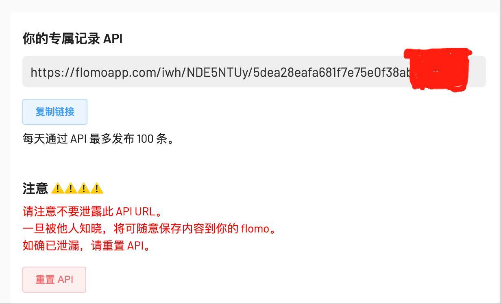
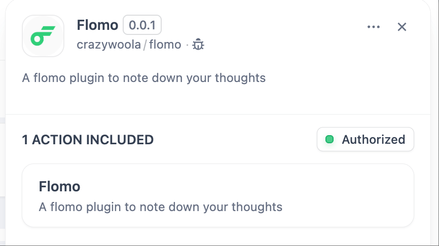
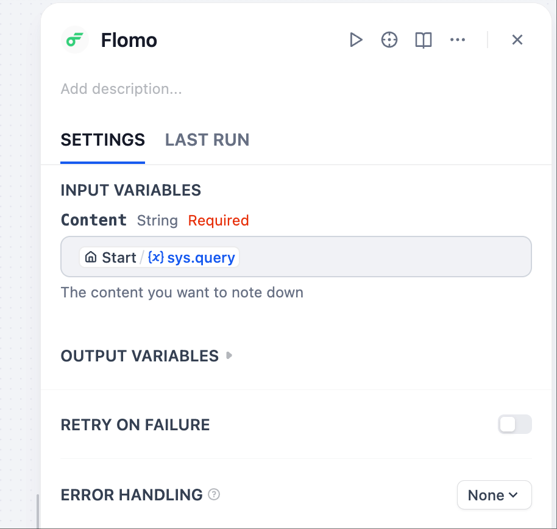

## flomo

**Author:** crazywoola
**Version:** 0.0.1
**Type:** tool

### Description

This is a flomo plugin to note down your thoughts. It allows you to create notes in your Flomo account using the Flomo API.

#### Authentication

Get the API URL from your [Flomo account settings](https://v.flomoapp.com/mine?source=incoming_webhook). The plugin uses this URL to interact with the Flomo API. 

#### Usage

To use this plugin, you need to provide the content of the note you want to create. The plugin will send a request to the Flomo API to create a new note with the provided content.

